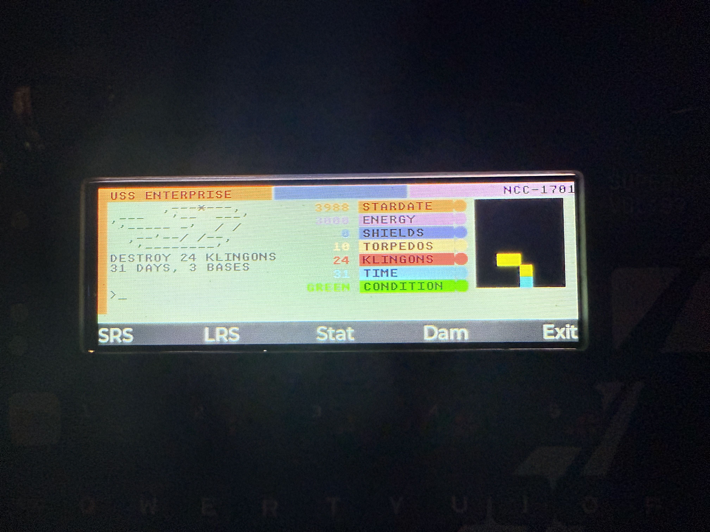

# Super Star Trek Game

A faithful recreation of the classic 1978 Super Star Trek game has been implemented in `firmware/badge/apps/userA.py`. This is a complete, playable space combat and exploration game adapted for the Hackaday Communicator Badge.

## Game Features

- **Classic Gameplay**: Authentic Super Star Trek mechanics from the original BASIC game
- **Mission**: Destroy all Klingon warships in the galaxy before time runs out
- **Galaxy Map**: Navigate through an 8×8 galaxy with multiple quadrants
- **Combat Systems**: Phasers and photon torpedoes for engaging enemy vessels
- **Resource Management**: Monitor and manage ship energy, shields, and supplies
- **Starbase Support**: Dock at starbases to repair and refuel
- **Damage System**: Ship systems can be damaged in combat, affecting functionality

## Display Layout

The game uses a three-column layout optimized for the badge's display:

- **Left Column**: Message log showing game events and command output, plus command input line at bottom
- **Middle Column**: Ship status display showing stardate, energy, shields, torpedoes, damage level, and current condition
- **Right Column**: Graphical display that switches between:
  - **SRS (Short Range Scan)**: 8×8 color-coded grid of current sector showing Enterprise (cyan), Klingons (red), Starbases (magenta), and Stars (yellow)
  - **LRS (Long Range Scan)**: 3×3 grid showing surrounding quadrants with Klingon/Base/Star counts

## Controls

- **F1**: Toggle to Short Range Scan view
- **F2**: Toggle to Long Range Scan view
- **F3**: Show detailed status
- **F4**: Show damage report
- **F5**: Exit game
- **Arrow Up/Down**: Scroll through message history
- **Type Commands**: Enter commands like `NAV 4 2` (navigate course 4 at warp 2)

## Game Commands

- `NAV <course> <warp>` or `N <course> <warp>`: Navigate to a new location
  - Course: 1-8 representing compass directions:
    ```
         7   8   1
          \  |  /
           \ | /
        6 -- E -- 2
           / | \
          /  |  \
         5   4   3
    ```
    - 1 = Up-Right
    - 2 = Right
    - 3 = Down-Right
    - 4 = Down
    - 5 = Down-Left
    - 6 = Left
    - 7 = Up-Left
    - 8 = Up
  - Warp: 0.1-8.0 (speed factor, affects distance traveled and energy consumption)
- `PHA <energy>` or `P <energy>`: Fire phasers with specified energy amount
- `TOR <course>` or `T <course>`: Fire photon torpedo in specified direction
- `SHE <amount>` or `H <amount>`: Transfer energy to shields
- `SRS` or `S`: Show short range scan
- `LRS` or `L`: Show long range scan
- `STA` or `ST`: Show full status report
- `DAM` or `D`: Show damage report
- `HELP` or `?`: Show command list

## Technical Features

- **Graphical Grids**: Uses LVGL objects for color-coded visual displays
- **Fixed-Width Font**: Retro terminal aesthetic using `font_unscii_8`
- **Message Scrolling**: Arrow key navigation through game history
- **Compact UI**: Efficient use of the badge's 428×142 pixel display
